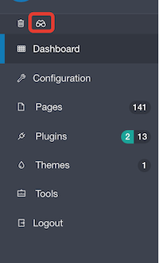
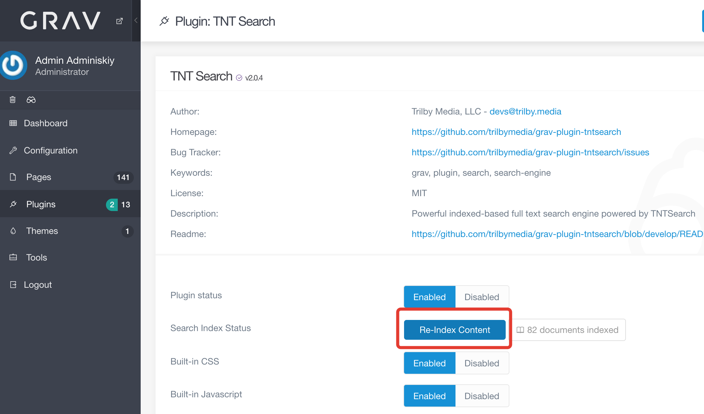
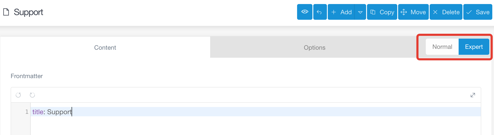

# OctNus website

## 1. Deploy
    $ .scripts/deploy.sh
Команда запускает обновление сайта из gitlab сброс и прогрев кеша

## 2. TNTSearch index
Для запуска индексирования всех страниц поиска по сайту неободимо нажать на иконку поиска в меню дашборда 

 

или запустить его из настроек компонента


 
или ввести команду:
    
     $ grav/plugin tntsearch index
## 3 Особенность индексирования страниц с шаблоном support
Так как tntsearch не индесирует поля с типом list, необходимо индексировать всю страницу целиком, в случае с саппортом для добавления в поисковый индекс небходимо:
  
  - Перейти в режим эксперта 
  - После заголовка добавить шаблон целиком в индекс tntsearch, чтоб получилось так:
    ```markdown
        title: Support
        tntsearch:
            template: support
    ```
   - Возможно сохранение упадет с ошибкой, нужно перезагрузить страницу без повторной отправки формы 
   - Запустить индексирование поиска (см раздел 2)


